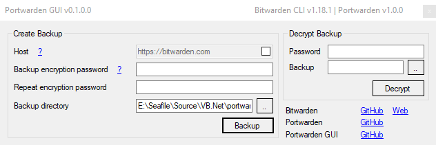

#  Portwarden GUI
Easy Bitwarden backups

## How to
- Run portwarden-gui.exe
  - Create backup
    - Input an encryption password
    - (Optional) Select a backup directory
    - Click Backup
    - Login with your bitwarden account
  - Decrypt backup
    - Input the encryption password
    - Select the backup to decrypt
    - Click Decrypt
- Wait for the process to finish

## Todo
- [ ] Support restore
- [ ] Automatically use latest release
  - [ ] of bitwarden
  - [ ] of portwarden

##### Links
| Name | GitHub | Web |
| --- | --- | --- |
| Bitwarden | [GitHub](https://github.com/bitwarden/) | [Web](https://bitwarden.com/) |
| Portwarden | [GitHub](https://github.com/vwxyzjn/portwarden) | |
| Portwarden GUI | [GitHub](https://github.com/mxve/portwarden-gui) | |